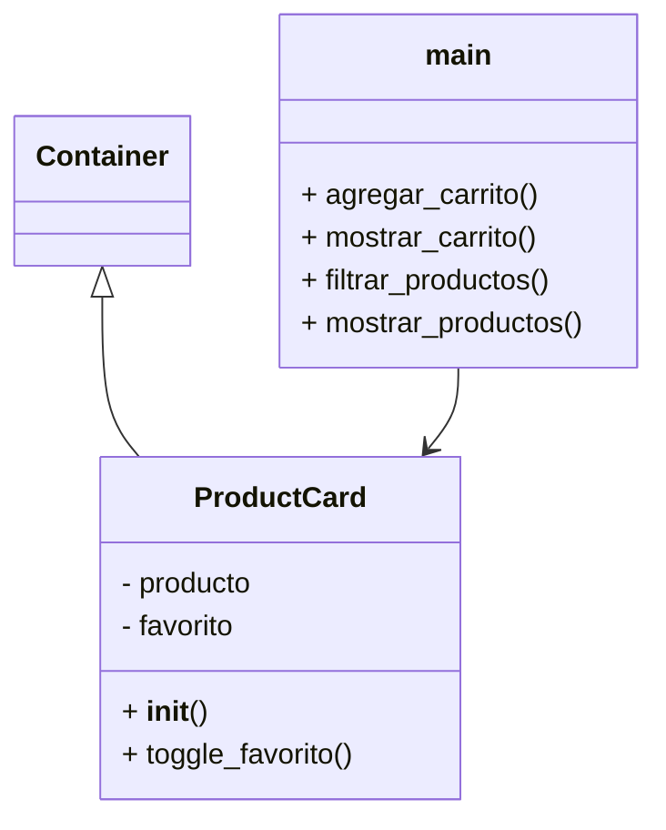

## Tienda web Aplicacion 
El sigueinte proyecto consiste en el desarrollo de una aplicación interactiva utilizando el lenguaje de programación Python junto con el framework Flet, el cual permite la creación de interfaces gráficas modernas de manera sencilla. La aplicación simula una tienda de tecnología donde se muestran diversos productos organizados en tarjetas visuales, cada una con información detallada como nombre, descripción, precio e imagen.

El sistema permite al usuario interactuar con los productos mediante diferentes funcionalidades, como marcar artículos como favoritos, agregarlos a un carrito de compras y realizar búsquedas dinámicas a través de un campo de texto. Para lograr una estructura ordenada y reutilizable, se implementó una clase personalizada que representa cada producto, aplicando el concepto de Programación Orientada a Objetos (POO), específicamente el uso de herencia.

## Definición y Configuración de la Clase ProductCard
En esta parte del código se define una clase llamada ProductCard, la cual hereda de la clase Container del framework Flet. Esto significa que ProductCard es un componente visual personalizado que se utiliza para representar cada producto dentro de la interfaz gráfica de la aplicación. Dentro del método constructor (init), se inicializan los atributos del objeto. Se recibe como parámetro un diccionario llamado "producto", que contiene la información del producto (como nombre, precio, descripción e imagen), y una función llamada "agregar_carrito", que permite añadir el producto al carrito de compras.

La instrucción super().init() se utiliza para llamar al constructor de la clase padre (Container), lo que permite que el componente herede todas sus propiedades visuales y de comportamiento. Posteriormente, se almacenan los datos del producto en la variable self.producto, y se crea una variable booleana llamada self.favorito, que inicialmente se establece en False para indicar que el producto no está marcado como favorito.

Luego, se configuran las propiedades visuales del componente, como el ancho (width), el espacio interno (padding), el margen externo (margin), el redondeo de las esquinas (border_radius) y el color de fondo (bgcolor). Estas propiedades permiten definir la apariencia de la tarjeta del producto.

Finalmente, se agrega una sombra al componente mediante la propiedad self.shadow, utilizando la clase BoxShadow. Esta sombra tiene un nivel de desenfoque (blur_radius), un color suave (BLACK12) y un desplazamiento (offset), lo que genera un efecto visual que hace que la tarjeta resalte sobre el fondo.

```python
class ProductCard(ft.Container):

    def __init__(self, producto, agregar_carrito):
        super().__init__()

        self.producto = producto
        self.favorito = False

        self.width = 260
        self.padding = 15
        self.margin = 10
        self.border_radius = 15
        self.bgcolor = ft.Colors.WHITE

        self.shadow = ft.BoxShadow(
            blur_radius=15,
            color=ft.Colors.BLACK12,
            offset=ft.Offset(2, 2)

```

## Funcionalidad del Botón de Favorito
En esta sección del código se implementa la funcionalidad que permite marcar un producto como favorito mediante un botón con ícono de corazón, primero, se define la función toggle_favorito, la cual se ejecuta cada vez que el usuario hace clic en el botón. Dentro de esta función, se cambia el estado de la variable self.favorito utilizando una negación lógica (not), lo que permite alternar entre verdadero (True) y falso (False).
Si el producto se marca como favorito (True), el ícono del botón cambia a un corazón lleno y se colorea de rojo, indicando visualmente que el producto ha sido seleccionado como favorito. En caso contrario, si el producto deja de ser favorito (False), el ícono cambia a un corazón vacío y se elimina el color.

La instrucción e.control.update() se encarga de actualizar el botón en la interfaz para reflejar los cambios realizados de manera inmediata. Posteriormente, se crea un botón de tipo IconButton llamado "corazon", el cual inicialmente muestra un corazón vacío. Este botón tiene asignado el evento on_click, que ejecuta la función toggle_favorito cuando el usuario interactúa con él.

De esta forma, se logra una interacción dinámica que permite al usuario marcar y desmarcar productos como favoritos dentro de la aplicación.

```python
        def toggle_favorito(e):
            self.favorito = not self.favorito

            if self.favorito:
                e.control.icon = ft.Icons.FAVORITE
                e.control.icon_color = ft.Colors.RED
            else:
                e.control.icon = ft.Icons.FAVORITE_BORDER
                e.control.icon_color = None

            e.control.update()

        corazon = ft.IconButton(
            icon=ft.Icons.FAVORITE_BORDER,
            on_click=toggle_favorito
        )
```

##  Estructura del Contenido de la Tarjeta de Producto
En esta parte del código se define el contenido visual de la tarjeta del producto mediante la propiedad self.content. Para organizar los elementos, se utiliza un componente Column del framework Flet, el cual permite distribuir los elementos de forma vertical. El parámetro spacing=10 establece un espacio entre cada uno de los elementos dentro de la columna, logrando una mejor organización visual. Dentro de la lista controls se agregan los distintos componentes que representan la información del producto. En primer lugar, se muestra el identificador (ID) del producto utilizando un componente Text, el cual incluye formato en negrita y color negro para resaltar la información.

Posteriormente, se incluye una imagen del producto mediante el componente Image. La imagen se carga desde la carpeta de recursos "assets", utilizando la ruta especificada en los datos del producto. Además, se definen dimensiones específicas (ancho y alto) para mantener un diseño uniforme. 

A continuación, se muestra el nombre del producto con un tamaño de texto mayor y en negrita, lo que permite destacarlo como el elemento principal de la tarjeta, finalmente, se presenta la descripción del producto mediante otro componente Text, con un tamaño más pequeño pero también en negrita, proporcionando información adicional de forma clara.

```python
        self.content = ft.Column(
            spacing=10,
            controls=[

                ft.Text(
                    f"ID: {producto['id']}",
                    size=12,
                    weight=ft.FontWeight.BOLD,
                    color=ft.Colors.BLACK
                ),

                ft.Image(
                    src=f"assets/{producto['ruta_imagen']}",
                    width=230,
                    height=150
                ),

                ft.Text(
                    producto["nombre"],
                    size=18,
                    weight=ft.FontWeight.BOLD,
                    color=ft.Colors.BLACK
                ),

                ft.Text(
                    producto["descripcion"],
                    size=12,
                    weight=ft.FontWeight.BOLD,
                    color=ft.Colors.BLACK
                ),


```

## Visualización del Precio y Acciones del Producto

En esta sección del código se completa la estructura visual de la tarjeta del producto, mostrando el precio y los botones de interacción disponibles para el usuario. Primero, se utiliza un componente Text para mostrar el precio del producto. Este se presenta con un formato que incluye el símbolo de moneda ($) y separadores de miles, lo que mejora la legibilidad. Además, el texto tiene un tamaño mayor y está en negrita, con el objetivo de destacarlo dentro de la tarjeta.

Posteriormente, se utiliza un componente Row para organizar horizontalmente los elementos de interacción. El parámetro alignment=SPACE_BETWEEN permite distribuir los elementos con espacio entre ellos, ubicando uno a la izquierda y otro a la derecha. Dentro de esta fila se incluyen dos elementos principales. El primero es el botón de favorito (corazon), que permite al usuario marcar o desmarcar el producto como favorito. El segundo es un botón de tipo ElevatedButton con el texto "Agregar al carrito" y un ícono de carrito de compras.

Este botón tiene asociado un evento on_click que ejecuta una función anónima (lambda). Cuando el usuario hace clic, se llama a la función agregar_carrito y se envía como argumento el producto actual, permitiendo así añadirlo al carrito de compras.


```python
                ft.Text(
                    f"${producto['precio']:,}",
                    size=18,
                    weight=ft.FontWeight.BOLD,
                    color=ft.Colors.BLACK
                ),

                ft.Row(
                    alignment=ft.MainAxisAlignment.SPACE_BETWEEN,
                    controls=[
                        corazon,

                        ft.ElevatedButton(
                            "Agregar al carrito",
                            icon=ft.Icons.SHOPPING_CART,
                            on_click=lambda e: agregar_carrito(self.producto)
                        )
                    ]
                )
            ]
        )
```

## Configuración Inicial de la Página y Variables del Carrito
En esta parte del código se define la función principal de la aplicación llamada main, la cual recibe como parámetro un objeto page de tipo Page proporcionado por el framework Flet. Esta función es la encargada de configurar toda la interfaz gráfica y la lógica principal del programa.

Primero, se establecen algunas propiedades de la página. Se define el título de la aplicación como "Tienda de Tecnología", se asigna un color de fondo mediante un código hexadecimal y se habilita el desplazamiento automático (scroll), lo que permite visualizar todos los elementos aunque excedan el tamaño de la pantalla. Posteriormente, se crea una estructura de datos llamada carrito, la cual es un diccionario vacío. Este diccionario se utiliza para almacenar los productos que el usuario agregue al carrito, junto con la cantidad de cada uno.

Luego, se define un componente de texto llamado contador, el cual se inicializa con el valor "0". Este elemento se utiliza para mostrar en pantalla la cantidad total de productos agregados al carrito. Además, se le aplican estilos como tamaño de texto, negrita y color.Finalmente, se crea otro componente de texto llamado texto_carrito, que inicialmente muestra el mensaje "Carrito vacío". Este elemento servirá para mostrar posteriormente la lista de productos que el usuario agregue al carrito, funcionando como un resumen de la compra.

```python

def main(page: ft.Page):

    page.title = "Tienda de Tecnología"
    page.bgcolor = "#CFEFFF"
    page.scroll = "auto"

    carrito = {}
    contador = ft.Text(
        "0",
        size=20,
        weight=ft.FontWeight.BOLD,
        color=ft.Colors.BLACK
    )

    texto_carrito = ft.Text(
        "Carrito vacío",
        size=16,
        weight=ft.FontWeight.BOLD,
        color=ft.Colors.BLACK
    )
```

## Función para Agregar Productos al Carrito
En esta sección del código se define la función agregar_carrito, la cual se encarga de gestionar la lógica para añadir productos al carrito de compras.

La función recibe como parámetro un objeto llamado producto, que contiene la información del artículo seleccionado. A partir de este objeto, se obtiene el nombre del producto, el cual se utiliza como clave dentro del diccionario carrito. Luego, se verifica si el producto ya existe en el carrito. Si el nombre del producto ya está presente, se incrementa su cantidad en uno. En caso contrario, si es la primera vez que se agrega, se crea una nueva entrada en el diccionario con valor inicial de uno.

Posteriormente, se actualiza el contador visual del carrito. Para ello, se suman todas las cantidades almacenadas en el diccionario carrito utilizando la función sum, y el resultado se convierte a texto para mostrarlo en el componente contador. Finalmente, se utiliza page.update() para refrescar la interfaz gráfica, asegurando que los cambios realizados se reflejen inmediatamente en pantalla.

```python
    def agregar_carrito(producto):

        nombre = producto["nombre"]

        if nombre in carrito:
            carrito[nombre] += 1
        else:
            carrito[nombre] = 1

        contador.value = str(sum(carrito.values()))
        page.update()

```

## Función para Mostrar el Contenido del Carrito
En esta parte del código se define la función mostrar_carrito, la cual se encarga de mostrar en pantalla los productos que el usuario ha agregado al carrito de compras. La función recibe un parámetro llamado e, que corresponde al evento generado al hacer clic en el botón del carrito. Aunque no se utiliza directamente dentro de la función, es necesario para manejar el evento en Flet.

Primero, se inicializa una variable llamada lista como una cadena de texto vacía. Esta variable se utilizará para construir el contenido que se mostrará al usuario. Luego, se recorre el diccionario carrito utilizando un ciclo for. En cada iteración, se obtienen el nombre del producto y la cantidad correspondiente. Estos valores se concatenan en la variable lista en un formato legible, por ejemplo: "Computadora x2", seguido de un salto de línea para separar cada producto.

Después, se verifica si la variable lista sigue vacía. Esto significa que no hay productos en el carrito. En ese caso, se asigna el mensaje "El carrito está vacío" para informar al usuario.Finalmente, el contenido de la variable lista se asigna al componente de texto texto_carrito, y se utiliza page.update() para actualizar la interfaz y mostrar los cambios en pantalla.

De esta manera, esta función permite visualizar de forma clara y organizada los productos seleccionados por el usuario dentro del carrito.


```python

    def mostrar_carrito(e):

        lista = ""

        for nombre, cantidad in carrito.items():
            lista += f"{nombre} x{cantidad}\n"

        if lista == "":
            lista = "El carrito está vacío"

        texto_carrito.value = lista
        page.update()
```


## Definición de la Lista de Productos
En esta sección del código se define una lista llamada productos, la cual contiene la información de todos los artículos que se mostrarán en la tienda.

Esta lista está compuesta por varios diccionarios, donde cada diccionario representa un producto diferente. Cada producto incluye atributos específicos que describen sus características, como el identificador (id), el nombre (nombre), la descripción (descripcion), el precio (precio) y la ruta de la imagen (ruta_imagen).

El campo id permite identificar de manera única cada producto, mientras que el nombre y la descripción proporcionan información textual para el usuario. El precio indica el costo del producto y se utiliza posteriormente para mostrarlo en la interfaz. Por otro lado, la ruta_imagen especifica el nombre del archivo de la imagen que se encuentra almacenado en la carpeta de recursos (assets).

Esta estructura de datos permite organizar la información de forma clara y facilita su uso dentro del programa, ya que se puede recorrer la lista para generar dinámicamente las tarjetas de productos en la interfaz gráfica.

En conjunto, la lista productos actúa como la fuente de datos principal de la aplicación, permitiendo mostrar múltiples elementos de manera automática sin necesidad de crear cada uno manualmente.

```python
    productos = [

        {
            "id": 1,
            "nombre": "Computadora",
            "descripcion": "Computadora de alto rendimiento",
            "precio": 20000,
            "ruta_imagen": "computadora.jpg"
        },

        {
            "id": 2,
            "nombre": "Bocina Bluetooth",
            "descripcion": "Bocina portátil",
            "precio": 900,
            "ruta_imagen": "bocina.jpg"
        },

        {
            "id": 3,
            "nombre": "Televisión",
            "descripcion": "Smart TV 4K",
            "precio": 7500,
            "ruta_imagen": "television.jpg"
        },

        {
            "id": 4,
            "nombre": "Audífonos",
            "descripcion": "Audio envolvente",
            "precio": 1200,
            "ruta_imagen": "audifonos.jpg"
        },

        {
            "id": 5,
            "nombre": "Teclado Mecánico",
            "descripcion": "Teclado RGB",
            "precio": 1500,
            "ruta_imagen": "teclado.jpg"
        }

    ]

```
##  Configuración del Contenedor de Productos (Grid)
En esta parte del código se crea un contenedor llamado grid utilizando el componente Row del framework Flet. Este contenedor se utiliza para organizar y mostrar todas las tarjetas de productos dentro de la interfaz.

El parámetro wrap=True permite que los elementos se acomoden automáticamente en varias filas cuando no hay suficiente espacio horizontal, logrando un efecto similar a una cuadrícula adaptable.

La propiedad spacing=20 define el espacio horizontal entre cada elemento, mientras que run_spacing=20 establece la separación vertical entre las filas de productos.

Además, se utiliza alignment=MainAxisAlignment.CENTER para centrar los elementos dentro del contenedor, lo que mejora la presentación visual de la aplicación.

En conjunto, este contenedor permite mostrar múltiples productos de forma ordenada, responsiva y visualmente equilibrada, facilitando la navegación del usuario dentro de la tienda.

```python
    grid = ft.Row(
        wrap=True,
        spacing=20,
        run_spacing=20,
        alignment=ft.MainAxisAlignment.CENTER
    )

```
## Función para Mostrar los Productos en la Interfaz
En esta sección del código se define la función mostrar_productos, la cual se encarga de generar y mostrar dinámicamente las tarjetas de productos en la interfaz gráfica. La función recibe como parámetro una lista llamada lista, que contiene los productos que se desean mostrar. Esto permite reutilizar la función tanto para mostrar todos los productos como para mostrar resultados filtrados.

Primero, se utiliza grid.controls.clear() para eliminar cualquier elemento que ya esté presente en el contenedor grid. Esto es importante para evitar que los productos se dupliquen cuando la función se ejecuta varias veces. Luego, se recorre la lista de productos utilizando un ciclo for. En cada iteración, se crea una nueva instancia de la clase ProductCard, enviando como argumentos el producto actual y la función agregar_carrito. Cada tarjeta generada se agrega al contenedor grid mediante el método append.

Por ultimmo se llama a page.update() para actualizar la interfaz gráfica y reflejar los cambios realizados en pantalla, de esta manera, esta función permite construir de forma dinámica la vista de productos, facilitando la actualización de la interfaz cuando cambian los datos, como en el caso de un filtrado o búsqueda.

```python
    def mostrar_productos(lista):

        grid.controls.clear()

        for producto in lista:
            grid.controls.append(ProductCard(producto, agregar_carrito))

        page.update()

```
## Función de Búsqueda y Filtrado de Productos

En esta parte del código se define la función filtrar_productos, la cual permite realizar una búsqueda dinámica de productos según el texto ingresado por el usuario.

La función recibe como parámetro una cadena de texto llamada texto, que corresponde a lo que el usuario escribe en el campo de búsqueda.

Primero, se crea una lista vacía llamada filtrados, la cual se utilizará para almacenar únicamente los productos que coincidan con la búsqueda.

Luego, se recorre la lista completa de productos mediante un ciclo for. En cada iteración, se toma un producto y se evalúa si el texto ingresado está contenido dentro del nombre del producto. Para ello, se utiliza el método lower(), tanto en el texto de búsqueda como en el nombre del producto, con el fin de hacer la comparación sin distinguir entre mayúsculas y minúsculas.

Si el nombre del producto contiene el texto buscado, dicho producto se agrega a la lista filtrados.

Finalmente, se llama a la función mostrar_productos, enviando la lista filtrada como argumento. Esto permite actualizar la interfaz gráfica y mostrar únicamente los productos que coinciden con la búsqueda.

De esta manera, se implementa un sistema de búsqueda en tiempo real que mejora la interacción del usuario con la aplicación.

```python
    def filtrar_productos(texto):

        filtrados = []

        for p in productos:
            if texto.lower() in p["nombre"].lower():
                filtrados.append(p)

        mostrar_productos(filtrados)

```
## Implementación del Buscador de Productos
En esta sección del código se implementa el campo de búsqueda que permite al usuario filtrar los productos de manera dinámica. Se crea un componente TextField llamado buscador, el cual funciona como una barra de búsqueda donde el usuario puede escribir el nombre del producto que desea encontrar. El atributo hint_text muestra un texto de ayuda dentro del campo ("Buscar producto..."), indicando su función.

Además, se configuran propiedades visuales como el ancho (width), el color de fondo (bgcolor) y los estilos del texto y del placeholder (hint_style), estableciendo color negro y negrita para mejorar la visibilidad. La propiedad más importante es on_change, la cual se ejecuta cada vez que el usuario escribe o modifica el contenido del campo. En este caso, se utiliza una función lambda que llama a la función filtrar_productos, enviando como argumento el texto actual ingresado por el usuario (e.control.value). Esto permite que la búsqueda se realice en tiempo real.

Finalmente, se llama a la función mostrar_productos(productos), la cual se encarga de mostrar todos los productos al inicio de la aplicación, antes de que el usuario realice cualquier búsqueda.
```python
    buscador = ft.TextField(
        hint_text="Buscar producto...",
        width=300,
        bgcolor=ft.Colors.WHITE,
        text_style=ft.TextStyle(
            color=ft.Colors.BLACK,
            weight=ft.FontWeight.BOLD
        ),
        hint_style=ft.TextStyle(
            color=ft.Colors.BLACK,
            weight=ft.FontWeight.BOLD
        ),
        on_change=lambda e: filtrar_productos(e.control.value)
    )


    mostrar_productos(productos)


```
## Diseño del Encabezado de la Aplicación
En esta sección del código se define el encabezado (header) de la aplicación, el cual se utiliza para mostrar el título de la tienda y el acceso al carrito de compras. Para organizar los elementos, se utiliza un componente Row, que permite alinear los elementos de forma horizontal. El parámetro alignment=MainAxisAlignment.SPACE_BETWEEN distribuye los elementos dejando espacio entre ellos, posicionando el título a la izquierda y el carrito a la derecha.

Dentro del encabezado, el primer elemento es un componente Text que muestra el título "TIENDA DE TECNOLOGÍA". Este texto se presenta con un tamaño grande, en negrita y color negro, con el objetivo de destacar el nombre de la aplicación. El segundo elemento es otro Row que contiene los componentes relacionados con el carrito de compras. Dentro de este se incluye un botón de tipo IconButton con el ícono de un carrito. Este botón tiene asignado el evento on_click, el cual ejecuta la función mostrar_carrito cuando el usuario hace clic, permitiendo visualizar los productos agregados.

Junto al botón se encuentra el componente contador, el cual muestra la cantidad total de productos en el carrito. Este valor se actualiza dinámicamente conforme el usuario agrega productos. En conjunto, este encabezado proporciona una estructura clara y funcional que facilita la navegación y el acceso rápido al carrito dentro de la aplicación.

```python
    header = ft.Row(
        alignment=ft.MainAxisAlignment.SPACE_BETWEEN,
        controls=[

            ft.Text(
                "TIENDA DE TECNOLOGÍA",
                size=30,
                weight=ft.FontWeight.BOLD,
                color=ft.Colors.BLACK
            ),

            ft.Row(
                controls=[
                    ft.IconButton(
                        icon=ft.Icons.SHOPPING_CART,
                        on_click=mostrar_carrito
                    ),
                    contador
                ]
            )
        ]
    )


```

## Construcción de la Interfaz y Ejecución de la Aplicación
En esta parte final del código se agregan todos los componentes a la página y se ejecuta la aplicación, primero, se utiliza el método page.add() para incorporar los elementos visuales a la interfaz en el orden en que se desean mostrar. Entre estos elementos se incluye el encabezado (header), el buscador, el contenedor de productos (grid) y un divisor visual (Divider) que separa las secciones de la aplicación.

Posteriormente, se agrega un componente de texto con el título "PRODUCTOS EN CARRITO", el cual sirve para identificar la sección donde se mostrarán los productos seleccionados por el usuario. Debajo de este título se incluye el componente texto_carrito, que se actualiza dinámicamente para mostrar el contenido del carrito.
Finalmente, se utiliza la función ft.run(main, assets_dir="assets") para ejecutar la aplicación. Esta instrucción indica que la función principal main es el punto de inicio del programa. Además, el parámetro assets_dir="assets" especifica la carpeta donde se encuentran los recursos locales, como las imágenes de los productos, permitiendo que el framework pueda cargarlos correctamente.

```python
    page.add(
        header,
        buscador,
        grid,
        ft.Divider(),
        ft.Text(
            "PRODUCTOS EN CARRITO",
            size=20,
            weight=ft.FontWeight.BOLD,
            color=ft.Colors.BLACK
        ),
        texto_carrito
    )


ft.run(main, assets_dir="assets")
```

## Diagrama de Clases de la Aplicación
El diagrama de clases representa de forma visual la estructura del programa, mostrando las clases utilizadas y la relación entre ellas.

En esta aplicación se identifican dos elementos principales: la clase ProductCard y la función principal main. La clase ProductCard es un componente personalizado que hereda de la clase Container del framework Flet, lo que le permite comportarse como un elemento visual dentro de la interfaz.

Por otro lado, la función main actúa como el controlador principal de la aplicación, ya que se encarga de crear la interfaz gráfica, gestionar los datos y generar múltiples instancias de la clase ProductCard para mostrar los productos.

La relación entre ambos elementos se da cuando la función main crea objetos de la clase ProductCard dentro del contenedor grid, enviando como parámetros la información de cada producto y la función para agregar al carrito. Esto demuestra una relación de uso, donde la clase principal utiliza la clase personalizada para construir la interfaz.

De esta manera, el diagrama de clases permite comprender cómo se organiza el programa, destacando el uso de la Programación Orientada a Objetos mediante la creación de componentes reutilizables.



## Explicación de la Herencia en el Componente Personalizado
En este proyecto se aplica el concepto de herencia de la Programación Orientada a Objetos para crear un componente personalizado dentro de la aplicación. La clase ProductCard hereda de la clase base Container del framework Flet, lo cual se observa en la siguiente línea de código: class ProductCard(ft.Container):.

Esto significa que ProductCard puede utilizar todas las propiedades y características que ya tiene Container, como el manejo de tamaños, colores, márgenes, bordes y la capacidad de contener otros elementos visuales.

Además, dentro del constructor se utiliza la instrucción super().__init__(), la cual permite llamar al constructor de la clase padre. Esto asegura que el componente herede correctamente todas sus funcionalidades antes de agregar las características propias de la tarjeta de producto.

Gracias a la herencia, no es necesario crear el componente desde cero, ya que se reutiliza la estructura de Container y se extiende con nuevas funcionalidades, como mostrar información del producto, imágenes y botones de interacción. Esto facilita el desarrollo, mejora la organización del código y permite reutilizar componentes dentro de la aplicación.

```python
class ProductCard(ft.Container):

    def __init__(self, producto, agregar_carrito):
        super().__init__()
```

